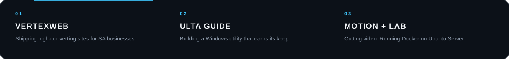
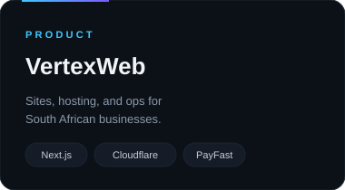
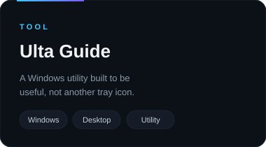
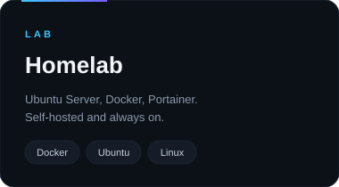

<!--
  VOID profile
  Custom SVG system lives in /assets
  Skill icons: https://skillicons.dev  — add an id to the i= list below
-->

  <picture>
    <source media="(prefers-color-scheme: dark)" srcset="./assets/hero-dark.svg" />
    <source media="(prefers-color-scheme: light)" srcset="./assets/hero-light.svg" />
    
  </picture>

 

  I'm <strong>James</strong>. I run <a href="https://vertexweb.co.za/">VertexWeb</a> — websites, hosting, and ops for South African businesses. 
  I also build Windows tools, ship games, run a homelab, and edit video.

  
  
  
  
  
  

  <picture>
    <source media="(prefers-color-scheme: dark)" srcset="./assets/divider-dark.svg" />
    <source media="(prefers-color-scheme: light)" srcset="./assets/divider-light.svg" />
    
  </picture>

## Now

  <picture>
    <source media="(prefers-color-scheme: dark)" srcset="./assets/now-dark.svg" />
    <source media="(prefers-color-scheme: light)" srcset="./assets/now-light.svg" />
    
  </picture>

## Work

  <a href="https://vertexweb.co.za/">
    <picture>
      <source media="(prefers-color-scheme: dark)" srcset="./assets/card-vertex-dark.svg" />
      <source media="(prefers-color-scheme: light)" srcset="./assets/card-vertex-light.svg" />
      
    </picture>
  </a>
  <picture>
    <source media="(prefers-color-scheme: dark)" srcset="./assets/card-ulta-dark.svg" />
    <source media="(prefers-color-scheme: light)" srcset="./assets/card-ulta-light.svg" />
    
  </picture>
  <picture>
    <source media="(prefers-color-scheme: dark)" srcset="./assets/card-lab-dark.svg" />
    <source media="(prefers-color-scheme: light)" srcset="./assets/card-lab-light.svg" />
    
  </picture>

  Also shipping games and experiments on <a href="https://the-real-voiddev.itch.io/">itch.io</a>.

## Stack

  <picture>
    <source media="(prefers-color-scheme: dark)" srcset="https://skillicons.dev/icons?i=html,css,js,ts,react,nextjs,flutter,dart,py,firebase,postgres,mysql,docker,ubuntu,linux,windows,cloudflare,github,vscode,godot,blender,ae,pr,figma&perline=8&theme=dark" />
    <source media="(prefers-color-scheme: light)" srcset="https://skillicons.dev/icons?i=html,css,js,ts,react,nextjs,flutter,dart,py,firebase,postgres,mysql,docker,ubuntu,linux,windows,cloudflare,github,vscode,godot,blender,ae,pr,figma&perline=8&theme=light" />
    
  </picture>

Also in the kit

- **SQL** — Postgres, MySQL, and whatever the job actually needs
- **DaVinci Resolve** — color and finishing
- **Portainer** — homelab control plane
- **Flame** — Flutter game work
- **Krita** — 2D when Blender is overkill
- **GitHub Actions** — keep the boring stuff automatic

## Activity

  <picture>
    <source media="(prefers-color-scheme: dark)" srcset="https://github-readme-stats.vercel.app/api?username=void-2smooth&show_icons=true&hide_border=true&bg_color=07090E&title_color=3EC8FF&icon_color=3EC8FF&text_color=C5D0DC&ring_color=3EC8FF" />
    <source media="(prefers-color-scheme: light)" srcset="https://github-readme-stats.vercel.app/api?username=void-2smooth&show_icons=true&hide_border=true&bg_color=F4F6F9&title_color=0A7ABF&icon_color=0A7ABF&text_color=0E141D&ring_color=0A7ABF" />
    
  </picture>
  <picture>
    <source media="(prefers-color-scheme: dark)" srcset="https://github-readme-stats.vercel.app/api/top-langs/?username=void-2smooth&layout=compact&hide_border=true&bg_color=07090E&title_color=3EC8FF&text_color=C5D0DC&langs_count=6" />
    <source media="(prefers-color-scheme: light)" srcset="https://github-readme-stats.vercel.app/api/top-langs/?username=void-2smooth&layout=compact&hide_border=true&bg_color=F4F6F9&title_color=0A7ABF&text_color=0E141D&langs_count=6" />
    
  </picture>

  <picture>
    <source media="(prefers-color-scheme: dark)" srcset="https://raw.githubusercontent.com/void-2smooth/void-2smooth/output/github-contribution-grid-snake-dark.svg" />
    <source media="(prefers-color-scheme: light)" srcset="https://raw.githubusercontent.com/void-2smooth/void-2smooth/output/github-contribution-grid-snake.svg" />
    
  </picture>

  <picture>
    <source media="(prefers-color-scheme: dark)" srcset="./assets/footer-dark.svg" />
    <source media="(prefers-color-scheme: light)" srcset="./assets/footer-light.svg" />
    
  </picture>

